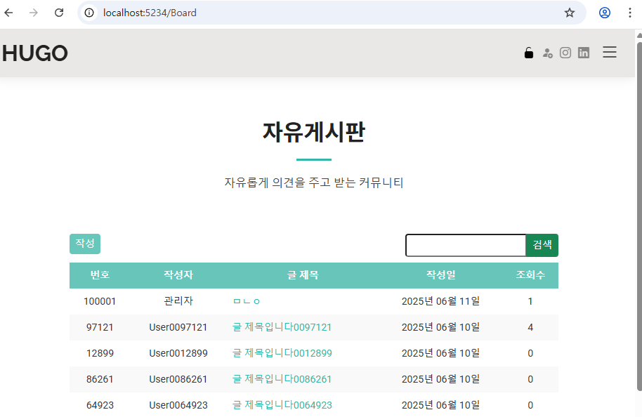

# 코테 보드 작업

### 결과 캡처
- 게시판 리스트 캡처본

- 작성 게시물 캡처본

### 작업 내용
1. 보드 컨트롤러, 뷰 코드에 뉴스의  컨트롤러, 뷰 코드 복사

2. 복사한 코드를 보며 News 내용은 Board 내용으로 변경
(ex. Description -> Contents, News -> Board)

3. 뉴스 모델와 보드 모델을 비교하며 보드 모델에 내용 추가.

4. Board는 Email도 포함하고 있기 때문에 컨트롤러, 뷰에 Email에 관한 내용도 추가

5. 보드용 저장 프로시저 생성

6. 보드DB에 더미데이터 삽입, 정상 로드 확인

7. 게시물 작성 테스트 완료

8. 게시물 수정 테스트 완료

9. 게시물 삭제 테스트 완료